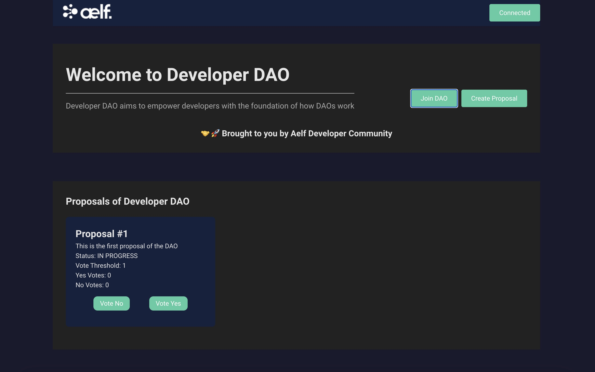

# Build a Voting dApp (Frontend) 

## Getting Started

Frontend of our [Voting dApp](https://learn.aelf.dev/docs/tutorial/stackup/frontend/).

## Pre-requisites

Before you begin, do ensure you have the following installed on your system:

- Git
- Node.js

## Project Setup 

1. Clone the repository
```bash
git clone https://github.com/AElfProject/vote-contract-frontend.git
```

2. Navigate to the project directory:
```bash
cd vote-contract-frontend
```

3. Install the necessary dependencies & libraries
```bash
npm install
```

Now that you're set up, you're ready to start the quest! Follow the steps as outlined in the campaign. Each step contains detailed instructions to guide you through the process

## Preview of Voting dApp



